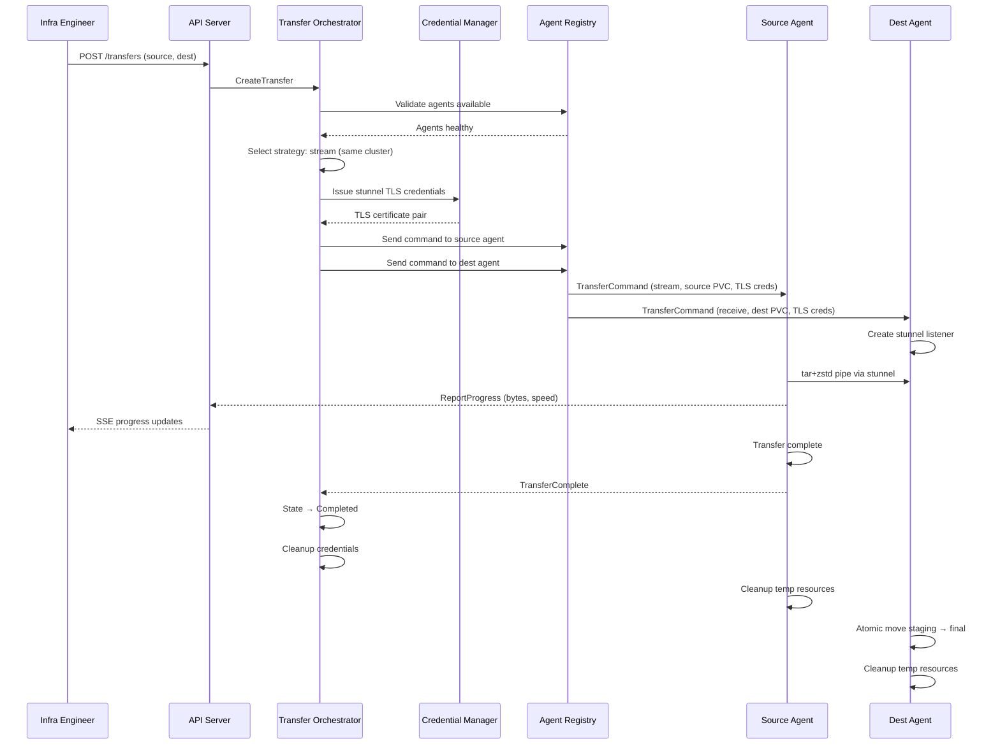
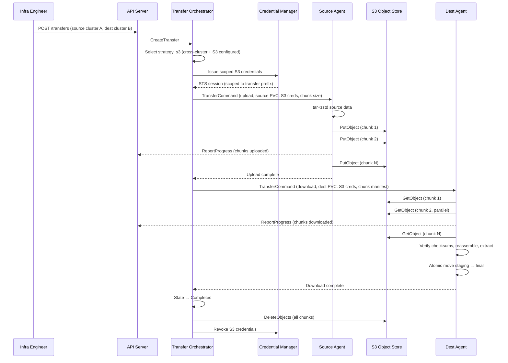
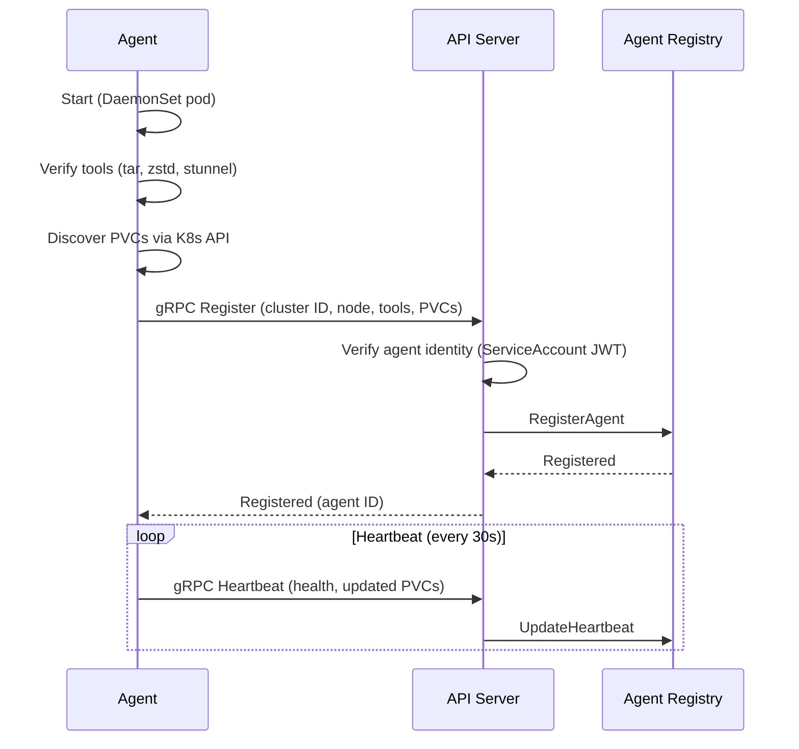
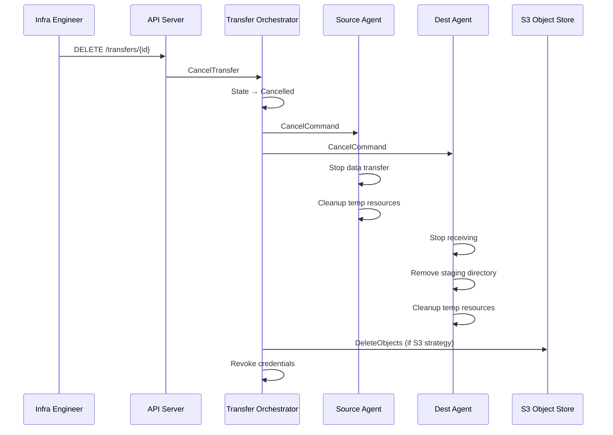

# Technical Design — Katapult

<!-- toc -->

- [1. Architecture Overview](#1-architecture-overview)
  - [1.1 Architectural Vision](#11-architectural-vision)
  - [1.2 Architecture Drivers](#12-architecture-drivers)
    - [Functional Drivers](#functional-drivers)
    - [NFR Allocation](#nfr-allocation)
  - [1.3 Architecture Layers](#13-architecture-layers)
- [2. Principles & Constraints](#2-principles-constraints)
  - [2.1 Design Principles](#21-design-principles)
    - [Agent Autonomy](#agent-autonomy)
    - [Outbound-Only Connectivity](#outbound-only-connectivity)
    - [API-First Design](#api-first-design)
    - [Encryption by Default](#encryption-by-default)
    - [Ephemeral Credentials Only](#ephemeral-credentials-only)
  - [2.2 Constraints](#22-constraints)
    - [Kubernetes-Only Deployment](#kubernetes-only-deployment)
    - [Agent Tool Dependencies](#agent-tool-dependencies)
    - [Single Control Plane Replica (v1)](#single-control-plane-replica-v1)
    - [S3 Required for Cross-Cluster Transfers](#s3-required-for-cross-cluster-transfers)
- [3. Technical Architecture](#3-technical-architecture)
  - [3.1 Domain Model](#31-domain-model)
  - [3.2 Component Model](#32-component-model)
    - [API Server](#api-server)
      - [Why this component exists](#why-this-component-exists)
      - [Responsibility scope](#responsibility-scope)
      - [Responsibility boundaries](#responsibility-boundaries)
      - [Related components (by ID)](#related-components-by-id)
    - [Transfer Orchestrator](#transfer-orchestrator)
      - [Why this component exists](#why-this-component-exists-1)
      - [Responsibility scope](#responsibility-scope-1)
      - [Responsibility boundaries](#responsibility-boundaries-1)
      - [Related components (by ID)](#related-components-by-id-1)
    - [Agent Registry](#agent-registry)
      - [Why this component exists](#why-this-component-exists-2)
      - [Responsibility scope](#responsibility-scope-2)
      - [Responsibility boundaries](#responsibility-boundaries-2)
      - [Related components (by ID)](#related-components-by-id-2)
    - [Credential Manager](#credential-manager)
      - [Why this component exists](#why-this-component-exists-3)
      - [Responsibility scope](#responsibility-scope-3)
      - [Responsibility boundaries](#responsibility-boundaries-3)
      - [Related components (by ID)](#related-components-by-id-3)
    - [CRD Controller](#crd-controller)
      - [Why this component exists](#why-this-component-exists-4)
      - [Responsibility scope](#responsibility-scope-4)
      - [Responsibility boundaries](#responsibility-boundaries-4)
      - [Related components (by ID)](#related-components-by-id-4)
    - [Agent Runtime](#agent-runtime)
      - [Why this component exists](#why-this-component-exists-5)
      - [Responsibility scope](#responsibility-scope-5)
      - [Responsibility boundaries](#responsibility-boundaries-5)
      - [Related components (by ID)](#related-components-by-id-5)
    - [Web UI](#web-ui)
      - [Why this component exists](#why-this-component-exists-6)
      - [Responsibility scope](#responsibility-scope-6)
      - [Responsibility boundaries](#responsibility-boundaries-6)
      - [Related components (by ID)](#related-components-by-id-6)
    - [Test Harness](#test-harness)
      - [Why this component exists](#why-this-component-exists-7)
      - [Responsibility scope](#responsibility-scope-7)
      - [Responsibility boundaries](#responsibility-boundaries-7)
      - [Related components (by ID)](#related-components-by-id-7)
  - [3.3 API Contracts](#33-api-contracts)
  - [3.4 Internal Dependencies](#34-internal-dependencies)
  - [3.5 External Dependencies](#35-external-dependencies)
    - [S3-Compatible Object Store](#s3-compatible-object-store)
    - [Kubernetes API](#kubernetes-api)
    - [PostgreSQL](#postgresql)
    - [Prometheus](#prometheus)
    - [controller-runtime/envtest](#controller-runtimeenvtest)
    - [Kind](#kind)
  - [3.6 Interactions & Sequences](#36-interactions-sequences)
    - [Intra-Cluster Streaming Transfer](#intra-cluster-streaming-transfer)
    - [Cross-Cluster S3-Staged Transfer](#cross-cluster-s3-staged-transfer)
    - [Agent Registration](#agent-registration)
    - [Transfer Cancellation](#transfer-cancellation)
  - [3.7 Database schemas & tables](#37-database-schemas-tables)
    - [Table: transfers](#table-transfers)
    - [Table: agents](#table-agents)
    - [Table: agent_pvcs](#table-agentpvcs)
    - [Table: transfer_events](#table-transferevents)
- [4. Additional context](#4-additional-context)
- [5. Traceability](#5-traceability)

<!-- /toc -->

## 1. Architecture Overview

### 1.1 Architectural Vision

Katapult uses a hub-and-spoke architecture with a centralized control plane and distributed agents deployed as Kubernetes DaemonSets on worker nodes. The control plane coordinates transfers, manages the agent registry, serves the REST/gRPC API and Web UI, and reconciles VolumeTransfer CRDs. Agents initiate outbound connections to the control plane, execute transfers autonomously, and report progress.

Three transfer strategies address different network topologies: a streaming mover for fast intra-cluster transfers (tar+zstd piped through stunnel), an object-store-staged mover for resumable cross-cluster transfers (chunked upload/download via S3), and a direct file-level mover as a cross-cluster fallback when S3 is unavailable. The strategy engine selects the optimal mover automatically based on source/destination topology, with manual override available.

The architecture follows three core tenets: agents are autonomous executors (transfers survive control plane outages once the data path is established), the control plane is a coordinator (it never sits in the data path), and all transfer data paths are encrypted by default. The CRD controller integrates with the Kubernetes API so that transfers are declarative, reconcilable, and observable via standard `kubectl` tooling.

### 1.2 Architecture Drivers

**Architecture Decisions**:

- `cpt-katapult-adr-hub-and-spoke` — Hub-and-spoke architecture with centralized control plane and distributed per-node agents; outbound-only agent connectivity
- `cpt-katapult-adr-multi-strategy-transfers` — Multiple transfer strategies (streaming, S3-staged, direct) with automatic topology-based selection
- `cpt-katapult-adr-use-go` — Go as the implementation language for control plane, agents, and CLI
- `cpt-katapult-adr-grpc-agent-communication` — gRPC bidirectional streaming for agent-to-control-plane communication

#### Functional Drivers

| Requirement | Design Response |
|-------------|------------------|
| `cpt-katapult-fr-initiate-transfer` | API Server exposes transfer creation endpoint; Transfer Orchestrator validates PVCs via Agent Registry before starting |
| `cpt-katapult-fr-cancel-transfer` | Transfer Orchestrator transitions state to Cancelled; agents receive cancellation signal and run cleanup |
| `cpt-katapult-fr-strategy-selection` | Strategy Engine evaluates source/destination topology and selects mover; operator override via API parameter |
| `cpt-katapult-fr-resumable-transfer` | Object-store mover uploads data as fixed-size chunks; download resumes from first missing chunk |
| `cpt-katapult-fr-destination-safety` | Agent writes to a staging directory first; atomic move to final path only on full completion; overwrite requires explicit opt-in |
| `cpt-katapult-fr-retry-backoff` | Transfer Orchestrator applies configurable exponential backoff per transfer phase |
| `cpt-katapult-fr-agent-registration` | Agents initiate outbound gRPC connection to control plane; Agent Registry stores cluster, node, and PVC inventory |
| `cpt-katapult-fr-agent-health` | Agent Registry tracks heartbeats; marks agents unhealthy after configurable timeout |
| `cpt-katapult-fr-pvc-discovery` | Agents query Kubernetes API for PVCs, resolve to PVs and node affinity, report inventory to Agent Registry |
| `cpt-katapult-fr-realtime-progress` | Agents stream progress via gRPC; API Server exposes SSE/WebSocket for UI/CLI consumers |
| `cpt-katapult-fr-transfer-history` | Transfer events persisted to PostgreSQL; queryable via API |
| `cpt-katapult-fr-metrics-logging` | Control plane and agents expose Prometheus `/metrics` endpoint; structured JSON logs with per-transfer correlation IDs |
| `cpt-katapult-fr-actionable-errors` | Agents enrich errors with context (disk space, permissions, network); control plane surfaces enriched errors to API |
| `cpt-katapult-fr-encryption-default` | Streaming mover uses stunnel (TLS); S3 mover uses HTTPS; direct mover uses stunnel; opt-out requires explicit flag |
| `cpt-katapult-fr-ephemeral-credentials` | Credential Manager issues scoped, short-lived S3 credentials (STS AssumeRole or presigned URLs) per transfer |
| `cpt-katapult-fr-agent-auth` | Agents authenticate via cluster identity tokens (Kubernetes ServiceAccount JWT); control plane validates before accepting registration |
| `cpt-katapult-fr-user-auth` | API Server enforces authentication via local credentials or OIDC; session idle timeout configurable (default 30 min) |
| `cpt-katapult-fr-user-authz` | API Server enforces RBAC middleware with operator and viewer roles |
| `cpt-katapult-fr-web-ui-transfers` | Web UI SPA consumes API for transfer CRUD, progress streaming, and cancellation |
| `cpt-katapult-fr-web-ui-agents` | Web UI SPA consumes Agent Registry API for agent/PVC overview |
| `cpt-katapult-fr-web-ui-validation` | Web UI implements client-side validation (same source/dest, size mismatch warning, confirmation dialogs) |
| `cpt-katapult-fr-cli` | CLI binary consumes same API as Web UI; supports all transfer operations and agent queries |
| `cpt-katapult-fr-api` | API Server is the single source of truth; Web UI and CLI are API clients |
| `cpt-katapult-fr-resource-cleanup` | Agents clean up local resources (services, secrets, staging dirs); control plane cleans up S3 objects and credentials on terminal state |
| `cpt-katapult-fr-pvc-boundary` | System reads source and writes destination; never provisions or deletes PVCs |
| `cpt-katapult-fr-transfer-autonomy` | Once data path is established, agents operate independently; control plane outage does not interrupt active transfers |
| `cpt-katapult-fr-crd` | CRD Controller (Kubebuilder) reconciles VolumeTransfer CRs; status subresource reflects transfer state |
| `cpt-katapult-fr-documentation` | CLI embeds help text; API documented via OpenAPI spec; deployment guide and onboarding guide as Markdown |
| `cpt-katapult-fr-controller-integration-tests` | Test Harness provides envtest-based controller test suite; CRD Controller component testable via `controller-runtime/pkg/envtest` with local etcd + API server |
| `cpt-katapult-fr-component-integration-tests` | Test Harness provides testcontainers-based component test suite; cross-component interactions validated via real PostgreSQL, MinIO, and gRPC servers in containers |
| `cpt-katapult-fr-e2e-tests` | Test Harness provides Kind-based E2E test suite; full Katapult stack deployed to ephemeral clusters with real PVC transfers and data integrity verification |

#### NFR Allocation

| NFR ID | NFR Summary | Allocated To | Design Response | Verification Approach |
|--------|-------------|--------------|-----------------|----------------------|
| `cpt-katapult-nfr-throughput-intra` | 5 TB intra-cluster in <30 min on 10 Gbps | `cpt-katapult-component-agent-runtime` (streaming mover) | tar+zstd pipe via stunnel between agents on same cluster; zero S3 overhead; direct node-to-node streaming | Benchmark: 5 TB transfer on 10 Gbps network, measure wall-clock time |
| `cpt-katapult-nfr-throughput-cross` | 5 TB cross-cluster in <12 hours with resume | `cpt-katapult-component-agent-runtime` (S3 mover) | Chunked upload/download with parallel operations; resume from first missing chunk | Benchmark: 5 TB cross-cluster transfer with simulated failure at 50%, measure total time |
| `cpt-katapult-nfr-bounded-failure` | Max wasted work ≤ 1 chunk or 1 pipeline run | `cpt-katapult-component-agent-runtime` | S3 mover: chunk-level checkpointing; streaming mover: pipeline-level restart | Fault injection: kill agent mid-transfer, verify resume point |
| `cpt-katapult-nfr-initiation-time` | <2 min from action to data movement | `cpt-katapult-component-transfer-orchestrator` | Pre-registered agents, pre-discovered PVCs; minimal validation before starting | End-to-end timing: API call to first bytes transferred |
| `cpt-katapult-nfr-progress-latency` | ≤5 sec agent → UI | `cpt-katapult-component-api-server` | gRPC streaming from agent; SSE/WebSocket push to UI; no polling | Measure latency from agent progress report to UI render |
| `cpt-katapult-nfr-cp-availability` | Best-effort single replica | `cpt-katapult-component-api-server` | Single Deployment replica; active transfers continue during downtime per agent autonomy | Simulate control plane restart during active transfer |
| `cpt-katapult-nfr-cp-recovery` | RTO <30 min; agent registry auto-rebuilds | `cpt-katapult-component-agent-registry` | PostgreSQL for durable state; agents re-register on reconnect; control plane stateless restart | Destroy control plane PV, redeploy, measure time to operational |
| `cpt-katapult-nfr-test-execution-time` | Test execution time bounds per tier | `cpt-katapult-component-test-harness` | Three-tier test architecture with build tag separation; envtest for fast controller tests, testcontainers for component tests, Kind for E2E | CI pipeline measures wall-clock per tier; fail if thresholds exceeded |

### 1.3 Architecture Layers

```
┌─────────────────────────────────────────────────────────┐
│                    Presentation Layer                     │
│  ┌──────────────┐  ┌──────────────┐                      │
│  │   Web UI      │  │   CLI        │                      │
│  │   (React SPA) │  │   (Go binary)│                      │
│  └──────┬───────┘  └──────┬───────┘                      │
│         │ REST/SSE        │ REST/gRPC                     │
├─────────┼─────────────────┼─────────────────────────────┤
│                      API Layer                            │
│  ┌──────────────────────────────────────────────────┐    │
│  │              API Server (gRPC-Gateway)             │    │
│  │  REST/gRPC endpoints, Auth middleware, RBAC        │    │
│  └──────┬────────────────────────────────┬──────────┘    │
│         │                                │                │
│  ┌──────┴───────┐              ┌────────┴──────────┐    │
│  │ CRD Controller│              │ Agent gRPC Server  │    │
│  │ (Kubebuilder) │              │ (bidirectional)    │    │
│  └──────┬───────┘              └────────┬──────────┘    │
├─────────┼───────────────────────────────┼───────────────┤
│                     Domain Layer                          │
│  ┌──────────────┐  ┌──────────────┐  ┌──────────────┐   │
│  │  Transfer     │  │   Agent      │  │  Credential   │   │
│  │  Orchestrator │  │   Registry   │  │  Manager      │   │
│  └──────────────┘  └──────────────┘  └──────────────┘   │
├──────────────────────────────────────────────────────────┤
│                  Infrastructure Layer                     │
│  ┌──────────┐  ┌──────────┐  ┌──────────┐  ┌─────────┐ │
│  │PostgreSQL │  │ K8s API  │  │ S3 Client│  │Prometheus│ │
│  └──────────┘  └──────────┘  └──────────┘  └─────────┘ │
└──────────────────────────────────────────────────────────┘

┌──────────────────────────────────────────────────────────┐
│                   Agent (per worker node)                  │
│  ┌──────────────┐  ┌──────────────┐  ┌──────────────┐   │
│  │ Agent Runtime │  │ Mover Plugins│  │ K8s Client   │   │
│  │ (gRPC client) │  │ stream|s3|   │  │ (PVC/PV      │   │
│  │              │  │ direct       │  │  discovery)   │   │
│  └──────────────┘  └──────────────┘  └──────────────┘   │
└──────────────────────────────────────────────────────────┘
```

- [ ] `p3` - **ID**: `cpt-katapult-tech-go`

| Layer | Responsibility | Technology |
|-------|---------------|------------|
| Presentation | Web UI for guided workflows; CLI for terminal users | React + TypeScript SPA; Go CLI binary |
| API | REST/gRPC gateway, CRD reconciliation, agent gRPC server | Go, gRPC-Gateway, Kubebuilder |
| Domain | Transfer orchestration, strategy selection, agent management, credential issuance | Go |
| Infrastructure | Persistence, Kubernetes API access, S3 operations, metrics | PostgreSQL, client-go, AWS SDK for Go, Prometheus client |

## 2. Principles & Constraints

### 2.1 Design Principles

#### Agent Autonomy

- [ ] `p1` - **ID**: `cpt-katapult-principle-agent-autonomy`

Once an agent receives a transfer command and the data path is established, the transfer completes independently of further control plane communication. The control plane coordinates but is never in the data path.

This principle directly satisfies `cpt-katapult-fr-transfer-autonomy` and supports `cpt-katapult-nfr-cp-availability` (active transfers continue during CP downtime).

#### Outbound-Only Connectivity

- [ ] `p1` - **ID**: `cpt-katapult-principle-outbound-only`

All agents initiate outbound connections to the control plane. The control plane never initiates connections into clusters. This eliminates firewall changes across all participating clusters.

This principle satisfies `cpt-katapult-fr-agent-registration` (agents initiate outbound connection).

#### API-First Design

- [ ] `p1` - **ID**: `cpt-katapult-principle-api-first`

Every operation goes through the REST/gRPC API. The Web UI and CLI are API clients with no privileged access. This ensures future automation and third-party integrations are first-class citizens.

This principle satisfies `cpt-katapult-fr-api` (single source of truth API).

#### Encryption by Default

- [ ] `p1` - **ID**: `cpt-katapult-principle-encryption-default`

All transfer data paths are encrypted. Direct agent-to-agent transfers use TLS (stunnel). S3-staged transfers use HTTPS. Disabling encryption requires explicit operator opt-out.

This principle satisfies `cpt-katapult-fr-encryption-default`.

#### Ephemeral Credentials Only

- [ ] `p1` - **ID**: `cpt-katapult-principle-ephemeral-credentials`

No long-lived shared secrets for data transfer. Every transfer receives fresh, scoped, short-lived credentials that become useless after the transfer completes.

This principle satisfies `cpt-katapult-fr-ephemeral-credentials`.

### 2.2 Constraints

#### Kubernetes-Only Deployment

- [ ] `p1` - **ID**: `cpt-katapult-constraint-k8s-only`

Katapult requires Kubernetes clusters with CSI-based node-local storage (TopoLVM, OpenEBS, or similar). The system is deployed as Kubernetes workloads: DaemonSet for agents and Deployment for the control plane.

#### Agent Tool Dependencies

- [ ] `p1` - **ID**: `cpt-katapult-constraint-agent-tools`

Worker nodes must have GNU tar >= 1.28 (with `--sort` support for deterministic streaming), zstd (compression), and stunnel (TLS tunneling). These may be bundled in the agent container image.

#### Single Control Plane Replica (v1)

- [ ] `p2` - **ID**: `cpt-katapult-constraint-single-cp`

v1 deploys a single control plane replica. High availability (leader election, state replication) is deferred to post-v1. Active transfers continue during control plane downtime per the Agent Autonomy principle.

#### S3 Required for Cross-Cluster Transfers

- [ ] `p1` - **ID**: `cpt-katapult-constraint-s3-required`

Cross-cluster transfers with resume capability require an S3-compatible object store accessible from all participating clusters. When S3 is unavailable, cross-cluster transfers fall back to the direct mover (without chunk-level resume).

## 3. Technical Architecture

### 3.1 Domain Model

**Technology**: Go structs

**Location**: To be defined during implementation (GREENFIELD — no code exists yet)

**Core Entities**:

| Entity | Description |
|--------|-------------|
| Transfer | A single volume copy operation from source PVC to destination PVC with lifecycle state, strategy, progress, and audit metadata |
| Agent | A registered agent process running on a Kubernetes worker node, reporting cluster identity, node name, health status, and PVC inventory |
| PVCInfo | A discovered Persistent Volume Claim with resolved PV binding, size, storage class, node affinity, and owning cluster |
| Chunk | A fixed-size segment (default 4 GiB) of compressed transfer data staged in object storage for cross-cluster transfers |
| Credential | A scoped, short-lived credential issued for a single transfer (STS session or presigned URL set) |

**Transfer State Machine**:

```
                ┌──────────┐
                │  Pending  │
                └────┬─────┘
                     │ validate PVCs & agents
                     ▼
                ┌──────────────┐
           ┌────│  Validating   │────┐
           │    └──────┬───────┘    │
           │           │ success    │ fail
           │           ▼            ▼
           │    ┌──────────────┐  ┌────────┐
    cancel │    │ Transferring  │  │ Failed │
           │    └──────┬───────┘  └────────┘
           │           │ success    ▲
           │           ▼            │ fail
           │    ┌──────────────┐   │
           │    │  Completed    │───┘
           │    └──────────────┘
           ▼
    ┌──────────────┐
    │  Cancelled    │
    └──────────────┘
```

**States**:
- **Pending** — Transfer created, awaiting validation
- **Validating** — Verifying source/destination PVCs exist, agents available, destination empty (or overwrite permitted)
- **Transferring** — Data movement in progress; agents report byte-level and chunk-level progress
- **Completed** — Data fully transferred, cleanup executed, audit record finalized
- **Failed** — Transfer failed after retry exhaustion; cleanup executed; actionable error surfaced
- **Cancelled** — Operator-initiated cancellation; cleanup executed; destination left in safe state

**Relationships**:
- Transfer → PVCInfo (source): one source PVC per transfer
- Transfer → PVCInfo (destination): one destination PVC per transfer
- Transfer → Agent (source): agent on source node
- Transfer → Agent (destination): agent on destination node
- Transfer → Chunk (0..N): zero chunks for streaming transfers, N chunks for S3-staged transfers
- Transfer → Credential (1): one ephemeral credential set per transfer
- Agent → PVCInfo (0..N): agent discovers and reports PVCs on its node

### 3.2 Component Model

```
┌─────────────── Control Plane ───────────────────────┐
│                                                      │
│  ┌────────────┐     ┌───────────────────┐           │
│  │ API Server  │◄───►│ Transfer          │           │
│  │             │     │ Orchestrator      │           │
│  └──────┬─────┘     └───────┬───────────┘           │
│         │                   │                        │
│  ┌──────┴─────┐     ┌──────┴──────┐  ┌───────────┐ │
│  │ CRD        │     │ Agent       │  │ Credential │ │
│  │ Controller  │     │ Registry    │  │ Manager    │ │
│  └────────────┘     └─────────────┘  └───────────┘ │
│                                                      │
│  ┌──────────────────────────────────────────────┐   │
│  │                PostgreSQL                     │   │
│  └──────────────────────────────────────────────┘   │
└──────────────────────────────────────────────────────┘
         ▲ gRPC (outbound from agents)
         │
┌────────┴───── Agent (per worker node) ──────────────┐
│  ┌──────────────┐  ┌────────────────────────────┐   │
│  │ Agent Runtime │  │ Mover Plugins              │   │
│  │ (gRPC client) │  │ ┌────────┐┌─────┐┌──────┐│   │
│  │              │  │ │Stream  ││ S3  ││Direct││   │
│  └──────────────┘  │ └────────┘└─────┘└──────┘│   │
│                     └────────────────────────────┘   │
└──────────────────────────────────────────────────────┘
```

#### API Server

- [ ] `p1` - **ID**: `cpt-katapult-component-api-server`

##### Why this component exists

Provides the single entry point for all external interactions — human operators (Web UI, CLI) and programmatic clients. Enforces authentication and authorization before any operation reaches the domain layer.

##### Responsibility scope

- Expose REST and gRPC endpoints for transfer CRUD, agent queries, and progress streaming
- Serve Web UI static assets
- Enforce authentication (local credentials, OIDC) and RBAC (operator, viewer roles)
- Manage gRPC server for agent connections (registration, commands, progress)
- Expose SSE/WebSocket endpoints for real-time progress to UI/CLI
- Expose Prometheus `/metrics` endpoint

##### Responsibility boundaries

- Does not execute transfers or manage data paths
- Does not make strategy decisions (delegates to Transfer Orchestrator)
- Does not interact with S3 or Kubernetes API directly (delegates to domain layer)

##### Related components (by ID)

- `cpt-katapult-component-transfer-orchestrator` — delegates transfer lifecycle operations
- `cpt-katapult-component-agent-registry` — delegates agent queries
- `cpt-katapult-component-credential-manager` — delegates credential issuance
- `cpt-katapult-component-crd-controller` — shares transfer state for CRD status updates

#### Transfer Orchestrator

- [ ] `p1` - **ID**: `cpt-katapult-component-transfer-orchestrator`

##### Why this component exists

Manages the full lifecycle of transfers from creation to terminal state, coordinating validation, strategy selection, agent commands, retries, and cleanup.

##### Responsibility scope

- Manage transfer state machine transitions (Pending → Validating → Transferring → terminal)
- Select transfer strategy based on source/destination topology (delegates to internal strategy engine logic)
- Issue transfer commands to agents via Agent Registry
- Apply retry with exponential backoff for failed transfer phases
- Trigger resource cleanup on terminal states
- Persist transfer state and audit events to PostgreSQL

##### Responsibility boundaries

- Does not execute data transfer (delegates to agents)
- Does not manage agent connections (delegates to Agent Registry)
- Does not issue credentials (delegates to Credential Manager)
- Does not reconcile CRDs (delegates to CRD Controller)

##### Related components (by ID)

- `cpt-katapult-component-api-server` — receives transfer requests from API
- `cpt-katapult-component-agent-registry` — queries agent availability and sends commands
- `cpt-katapult-component-credential-manager` — requests per-transfer credentials
- `cpt-katapult-component-crd-controller` — CRD controller reads transfer state for status updates

#### Agent Registry

- [ ] `p1` - **ID**: `cpt-katapult-component-agent-registry`

##### Why this component exists

Maintains the inventory of all registered agents, their health status, and discovered PVCs. Provides the foundation for transfer validation (are agents available?) and PVC selection (what PVCs exist where?).

##### Responsibility scope

- Accept agent registrations via gRPC (cluster identity, node name, capabilities)
- Track agent heartbeats and mark agents unhealthy after configurable timeout
- Store and serve PVC inventory reported by agents (name, namespace, size, storage class, node affinity)
- Provide agent lookup for transfer validation (source/destination agent availability)
- Forward transfer commands to connected agents
- Auto-rebuild registry when agents reconnect after control plane restart

##### Responsibility boundaries

- Does not execute transfers
- Does not authenticate agents (authentication handled by API Server gRPC middleware)
- Does not manage PVC lifecycle (agents report PVCs, registry only stores inventory)

##### Related components (by ID)

- `cpt-katapult-component-api-server` — agent gRPC connections terminate at API Server, routed to registry
- `cpt-katapult-component-transfer-orchestrator` — queries agent availability, sends commands via registry

#### Credential Manager

- [ ] `p1` - **ID**: `cpt-katapult-component-credential-manager`

##### Why this component exists

Isolates credential issuance and lifecycle management. Every transfer gets unique, scoped, short-lived credentials that limit blast radius on compromise.

##### Responsibility scope

- Issue per-transfer S3 credentials via STS AssumeRole (scoped to transfer-specific S3 prefix)
- Generate presigned URLs as fallback for non-STS S3 environments
- Issue TLS certificates or pre-shared keys for stunnel-based direct transfers
- Revoke credentials on transfer completion, failure, or cancellation
- Track credential expiry and refresh if transfer outlives credential lifetime

##### Responsibility boundaries

- Does not manage user authentication (handled by API Server)
- Does not manage agent authentication (handled by API Server gRPC middleware)
- Does not interact with S3 data operations (agents use issued credentials directly)

##### Related components (by ID)

- `cpt-katapult-component-transfer-orchestrator` — requests credentials when starting a transfer
- `cpt-katapult-component-agent-runtime` — receives credentials to authenticate with S3 or peer agent

#### CRD Controller

- [ ] `p1` - **ID**: `cpt-katapult-component-crd-controller`

##### Why this component exists

Integrates Katapult with the Kubernetes API, enabling declarative transfer management via VolumeTransfer custom resources. Supports GitOps workflows and standard `kubectl` tooling.

##### Responsibility scope

- Reconcile VolumeTransfer custom resources using Kubebuilder-generated controller
- Translate CRD spec into Transfer Orchestrator API calls (create, cancel)
- Update CRD status subresource from transfer state (phase, progress, errors)
- Handle CRD deletion (trigger transfer cancellation if active)

##### Responsibility boundaries

- Does not manage transfer state directly (delegates to Transfer Orchestrator)
- Does not manage agent connections
- Does not serve external API traffic (API Server handles that)

##### Related components (by ID)

- `cpt-katapult-component-transfer-orchestrator` — calls orchestrator to create/cancel transfers; reads state for status updates
- `cpt-katapult-component-api-server` — shares the same process; CRD controller is an internal component of the control plane binary

#### Agent Runtime

- [ ] `p1` - **ID**: `cpt-katapult-component-agent-runtime`

##### Why this component exists

Executes the actual data transfer on worker nodes. Provides pluggable mover implementations for different transfer strategies and reports progress to the control plane.

##### Responsibility scope

- Maintain gRPC connection to control plane (outbound-initiated)
- Execute transfers using pluggable movers:
  - **Stream Mover**: tar+zstd pipe via stunnel for intra-cluster transfers
  - **S3 Mover**: chunked upload/download via S3 API for cross-cluster transfers
  - **Direct Mover**: rsync/tar via stunnel for cross-cluster fallback without S3
- Report real-time progress (bytes transferred, speed, chunks completed) via gRPC streaming
- Discover PVCs by querying Kubernetes API and report to Agent Registry
- Manage temporary Kubernetes resources (Services, Secrets) for transfer data paths
- Clean up all transfer-created resources on terminal state
- Write to staging directory first; atomic move to final path only on success
- Surface actionable error messages enriched with local context (disk space, permissions)

##### Responsibility boundaries

- Does not make strategy decisions (receives strategy from control plane)
- Does not persist transfer state (reports progress, control plane persists)
- Does not issue credentials (receives credentials from control plane)
- Does not provision or delete PVCs

##### Related components (by ID)

- `cpt-katapult-component-api-server` — connects via gRPC for registration, commands, progress
- `cpt-katapult-component-credential-manager` — receives per-transfer credentials
- `cpt-katapult-component-agent-registry` — registration and heartbeat target

#### Web UI

- [ ] `p2` - **ID**: `cpt-katapult-component-web-ui`

##### Why this component exists

Provides a guided, browser-based interface for support engineers who are not Kubernetes specialists. Enables self-service transfer operations without CLI or kubectl knowledge.

##### Responsibility scope

- Guided transfer creation workflow (cluster → node → PVC dropdowns)
- Real-time transfer dashboard (progress bars, speed, ETA, chunk progress)
- Transfer detail view with full event timeline
- Agent overview grouped by cluster (health, PVCs, tool versions)
- Client-side validation (same source/dest prevention, size mismatch warning, confirmation dialogs)
- Strategy explanation (why a particular strategy was auto-selected)

##### Responsibility boundaries

- Does not call Kubernetes API or S3 directly — API-only client
- Does not enforce authorization (API Server enforces RBAC)
- Does not execute transfers

##### Related components (by ID)

- `cpt-katapult-component-api-server` — sole backend; all data fetched via REST, progress via SSE/WebSocket

#### Test Harness

- [ ] `p2` - **ID**: `cpt-katapult-component-test-harness`

##### Why this component exists

Provides reusable test infrastructure for validating Katapult across three tiers (controller, component, E2E) without requiring shared or long-lived test clusters. Ensures all PRD testing requirements (`cpt-katapult-fr-controller-integration-tests`, `cpt-katapult-fr-component-integration-tests`, `cpt-katapult-fr-e2e-tests`) are met with reproducible, isolated test environments.

##### Responsibility scope

- Envtest environment setup for CRD Controller reconciliation tests (local etcd + API server, CRD installation, VolumeTransfer status assertion helpers)
- Testcontainers orchestration for component integration tests (PostgreSQL, MinIO, gRPC server/client setup, test fixture seeding)
- Kind cluster lifecycle for E2E tests (cluster creation/teardown, Katapult deployment, PVC provisioning with local-path provisioner, data integrity checksum verification)
- Build tag separation: `//go:build integration` (tier 2), `//go:build e2e` (tier 3)
- Shared test helpers: fixture builders, assertion utilities, container lifecycle management

##### Responsibility boundaries

- Does not contain business logic or production code
- Does not define transfer strategies or domain models
- Does not replace unit tests (unit tests use existing `testutil.MemRepo` pattern)

##### Related components (by ID)

- `cpt-katapult-component-crd-controller` — primary target of envtest-based controller tests
- `cpt-katapult-component-api-server` — validated via component integration tests (REST/gRPC)
- `cpt-katapult-component-agent-runtime` — validated via E2E tests (full transfer path)
- `cpt-katapult-component-transfer-orchestrator` — validated via component and E2E tests

### 3.3 API Contracts

- [ ] `p1` - **ID**: `cpt-katapult-interface-control-plane-api`

- **Contracts**: `cpt-katapult-contract-s3`, `cpt-katapult-contract-prometheus`
- **Technology**: REST (gRPC-Gateway) + gRPC
- **Stability**: unstable (v1alpha1)

**REST API Endpoints Overview** (`/api/v1alpha1/`):

| Method | Path | Description | Stability |
|--------|------|-------------|-----------|
| `POST` | `/transfers` | Create a new transfer | unstable |
| `GET` | `/transfers` | List transfers (with filtering) | unstable |
| `GET` | `/transfers/{id}` | Get transfer detail with progress | unstable |
| `DELETE` | `/transfers/{id}` | Cancel an active transfer | unstable |
| `GET` | `/transfers/{id}/events` | Get transfer event timeline | unstable |
| `GET` | `/transfers/{id}/progress` | SSE stream for real-time progress | unstable |
| `GET` | `/agents` | List registered agents | unstable |
| `GET` | `/agents/{id}` | Get agent detail with PVCs | unstable |
| `GET` | `/agents/{id}/pvcs` | List PVCs on agent's node | unstable |
| `GET` | `/clusters` | List known clusters | unstable |

**gRPC Service** (agent-facing, internal):

| Service | RPC | Description |
|---------|-----|-------------|
| AgentService | Register | Agent registers with cluster identity and capabilities |
| AgentService | Heartbeat | Periodic health check with PVC inventory updates |
| AgentService | StreamCommands | Server-streaming RPC for transfer commands to agent |
| AgentService | ReportProgress | Client-streaming RPC for transfer progress from agent |

**VolumeTransfer CRD** (`katapult.io/v1alpha1`):

| Field | Type | Description |
|-------|------|-------------|
| `spec.source` | SourceSpec | Source cluster + PVC reference |
| `spec.destination` | DestinationSpec | Destination cluster + PVC reference |
| `spec.strategy` | string (optional) | Manual strategy override (stream, s3, direct) |
| `spec.allowOverwrite` | bool | Allow overwriting non-empty destination |
| `spec.retry` | RetrySpec | Max attempts, backoff config |
| `status.phase` | string | Current transfer state |
| `status.progress` | ProgressStatus | Bytes transferred, total, speed, ETA, chunks |
| `status.conditions` | []Condition | Standard Kubernetes conditions |

### 3.4 Internal Dependencies

| Dependency Component | Interface Used | Purpose |
|---------------------|----------------|----------|
| Transfer Orchestrator → Agent Registry | Go interface | Query agent availability, forward transfer commands |
| Transfer Orchestrator → Credential Manager | Go interface | Request per-transfer credentials |
| CRD Controller → Transfer Orchestrator | Go interface | Create/cancel transfers, read state for CRD status |
| API Server → Transfer Orchestrator | Go interface | Handle transfer API requests |
| API Server → Agent Registry | Go interface | Handle agent API queries, route gRPC connections |

**Dependency Rules**:
- No circular dependencies between domain components
- API Server is the only component accepting external connections
- CRD Controller and API Server share the same process (single control plane binary)
- All inter-component communication within control plane is in-process (Go interfaces, not network)

### 3.5 External Dependencies

#### S3-Compatible Object Store

| Dependency | Interface Used | Purpose |
|-----------|---------------|---------|
| Agent Runtime (S3 Mover) | AWS S3 API (PutObject, GetObject, DeleteObject, ListObjectsV2, CreateMultipartUpload) | Upload/download transfer data chunks for cross-cluster transfers |
| Credential Manager | AWS STS API (AssumeRole) or presigned URL generation | Issue scoped credentials per transfer |

**Dependency Rules**:
- Only agents interact with S3 for data operations
- Only Credential Manager interacts with STS for credential issuance
- S3 is optional — only required for cross-cluster transfers with resume capability

#### Kubernetes API

| Dependency | Interface Used | Purpose |
|-----------|---------------|---------|
| CRD Controller | controller-runtime (Kubebuilder) | Reconcile VolumeTransfer CRDs |
| Agent Runtime | client-go | Discover PVCs, resolve PV bindings and node affinity, manage temporary Services/Secrets |

#### PostgreSQL

| Dependency | Interface Used | Purpose |
|-----------|---------------|---------|
| Control plane (all domain components) | database/sql + pgx driver | Persist transfer state, agent registry, transfer events, configuration |

#### Prometheus

| Dependency | Interface Used | Purpose |
|-----------|---------------|---------|
| API Server, Agent Runtime | prometheus/client_golang | Expose `/metrics` for transfer throughput, duration, success/failure rates, agent health |

#### controller-runtime/envtest

| Dependency | Interface Used | Purpose |
|-----------|---------------|---------|
| Test Harness (controller tests) | `envtest.Environment` (Start/Stop local etcd + API server) | Run CRD Controller reconciliation tests without a real cluster |

#### Kind

| Dependency | Interface Used | Purpose |
|-----------|---------------|---------|
| Test Harness (E2E tests) | `sigs.k8s.io/kind` Go API or CLI (`kind create cluster`) | Create/destroy ephemeral Kubernetes clusters for E2E tests |

### 3.6 Interactions & Sequences

#### Intra-Cluster Streaming Transfer

**ID**: `cpt-katapult-seq-intra-transfer`

**Use cases**: `cpt-katapult-usecase-intra-transfer`

**Actors**: `cpt-katapult-actor-infra-engineer`



**Description**: For intra-cluster transfers, the orchestrator selects the streaming strategy. Source agent pipes tar+zstd output through a stunnel TLS tunnel directly to the destination agent. Destination agent writes to a staging directory and performs an atomic move on completion.

#### Cross-Cluster S3-Staged Transfer

**ID**: `cpt-katapult-seq-cross-transfer`

**Use cases**: `cpt-katapult-usecase-cross-transfer`

**Actors**: `cpt-katapult-actor-infra-engineer`



**Description**: For cross-cluster transfers, data is compressed and split into fixed-size chunks uploaded to S3. The destination agent downloads chunks in parallel, verifies checksums, reassembles, and extracts. On failure at any point, agents resume from the first missing chunk.

#### Agent Registration

**ID**: `cpt-katapult-seq-agent-registration`

**Use cases**: `cpt-katapult-usecase-intra-transfer`, `cpt-katapult-usecase-cross-transfer`

**Actors**: `cpt-katapult-actor-agent`



**Description**: Agents register on startup by initiating an outbound gRPC connection. The control plane verifies identity via Kubernetes ServiceAccount JWT, stores the registration, and expects periodic heartbeats.

#### Transfer Cancellation

**ID**: `cpt-katapult-seq-cancel-transfer`

**Use cases**: `cpt-katapult-usecase-cancel-transfer`

**Actors**: `cpt-katapult-actor-infra-engineer`



**Description**: Cancellation transitions the transfer to Cancelled state, signals both agents to stop, and triggers cleanup of all resources (temp services, staging directories, S3 objects, credentials). Destination PVC is left in a safe state.

### 3.7 Database schemas & tables

#### Table: transfers

**ID**: `cpt-katapult-dbtable-transfers`

**Schema**:

| Column | Type | Description |
|--------|------|-------------|
| id | uuid | Transfer ID (PK) |
| source_cluster | text | Source cluster identifier |
| source_pvc | text | Source PVC name (namespace/name) |
| destination_cluster | text | Destination cluster identifier |
| destination_pvc | text | Destination PVC name (namespace/name) |
| strategy | text | Transfer strategy (stream, s3, direct) |
| state | text | Current state (pending, validating, transferring, completed, failed, cancelled) |
| allow_overwrite | boolean | Whether destination overwrite is permitted |
| bytes_transferred | bigint | Bytes transferred so far |
| bytes_total | bigint | Total bytes to transfer |
| chunks_completed | integer | Chunks completed (S3 strategy) |
| chunks_total | integer | Total chunks (S3 strategy) |
| error_message | text | Actionable error message (if failed) |
| retry_count | integer | Number of retries attempted |
| retry_max | integer | Maximum retries configured |
| created_by | text | User who initiated the transfer |
| created_at | timestamptz | Creation timestamp |
| started_at | timestamptz | When data transfer began |
| completed_at | timestamptz | When transfer reached terminal state |

**PK**: `id`

**Constraints**: `state IN ('pending', 'validating', 'transferring', 'completed', 'failed', 'cancelled')`

**Indexes**: `idx_transfers_state` on `state`, `idx_transfers_created_at` on `created_at`

#### Table: agents

**ID**: `cpt-katapult-dbtable-agents`

**Schema**:

| Column | Type | Description |
|--------|------|-------------|
| id | uuid | Agent ID (PK) |
| cluster_id | text | Cluster identifier |
| node_name | text | Kubernetes node name |
| healthy | boolean | Current health status |
| last_heartbeat | timestamptz | Last heartbeat timestamp |
| tools | jsonb | Available tool versions (tar, zstd, stunnel) |
| registered_at | timestamptz | First registration timestamp |

**PK**: `id`

**Constraints**: `UNIQUE (cluster_id, node_name)`

**Indexes**: `idx_agents_cluster` on `cluster_id`, `idx_agents_healthy` on `healthy`

#### Table: agent_pvcs

**ID**: `cpt-katapult-dbtable-agent-pvcs`

**Schema**:

| Column | Type | Description |
|--------|------|-------------|
| agent_id | uuid | FK to agents.id |
| pvc_name | text | PVC name (namespace/name) |
| size_bytes | bigint | PVC size in bytes |
| storage_class | text | Kubernetes storage class |
| node_affinity | text | Node the PV is bound to |
| updated_at | timestamptz | Last update from agent heartbeat |

**PK**: `(agent_id, pvc_name)`

**Constraints**: `agent_id REFERENCES agents(id) ON DELETE CASCADE`

#### Table: transfer_events

**ID**: `cpt-katapult-dbtable-transfer-events`

**Schema**:

| Column | Type | Description |
|--------|------|-------------|
| id | uuid | Event ID (PK) |
| transfer_id | uuid | FK to transfers.id |
| event_type | text | Event type (created, validated, started, progress, completed, failed, cancelled, retried) |
| message | text | Human-readable event description |
| metadata | jsonb | Additional event data (speeds, errors, agent info) |
| created_at | timestamptz | Event timestamp |

**PK**: `id`

**Constraints**: `transfer_id REFERENCES transfers(id) ON DELETE CASCADE`

**Indexes**: `idx_transfer_events_transfer_id` on `transfer_id`, `idx_transfer_events_created_at` on `created_at`

## 4. Additional context

Katapult is a Kubernetes infrastructure tool designed for blockchain node operators at Chainstack. Every transfer is a one-shot full copy — there are no incremental syncs. Once data is transferred, the destination node runs independently.

The system handles volumes ranging from 200 GiB to 15 TB across 10 globally distributed Kubernetes clusters. The primary use case is bootstrapping blockchain nodes from volume snapshots to avoid multi-day/week sync times that violate SLAs.

**Not applicable sections**:

- **Performance Architecture (PERF)**: Not applicable as a standalone section because performance concerns are addressed directly in the NFR Allocation table (Section 1.2) and in the mover implementation details within the Agent Runtime component. Katapult's performance is dominated by network throughput and disk I/O, not by application-level caching or scaling patterns.
- **Scalability (PERF-DESIGN-002)**: Not applicable for v1. Single control plane replica handles transfer coordination for 10 clusters. Agents scale naturally as DaemonSets. No horizontal scaling of the control plane is needed at current scale.
- **Compliance Architecture (COMPL)**: Not applicable — Katapult transfers blockchain state data (block headers, transaction indexes, state tries), not personal data. No PII processing. GDPR, HIPAA, PCI DSS do not apply. See PRD Section 6.2 NFR Exclusions.
- **Privacy Architecture (COMPL-DESIGN-002)**: Not applicable — no personal data is processed. See PRD Section 6.2.
- **User-Facing Architecture (UX-DESIGN-001)**: Not applicable as a detailed section — Web UI is a standard React SPA consuming the REST API. No offline support, no progressive enhancement, no responsive design requirements. The UI is accessed from operator workstations only. See PRD Section 6.2.
- **Capacity and Cost Budgets (ARCH-DESIGN-010)**: Not applicable for v1 — single control plane replica, 10 clusters, DaemonSet agents. Capacity is bounded by current infrastructure. Cost optimization deferred to post-v1 when HA and multi-tenancy are considered.

**Addressed in dedicated sections**:

- **Security Architecture (SEC)**: Addressed via Design Principles (Section 2.1: `cpt-katapult-principle-encryption-default`, `cpt-katapult-principle-ephemeral-credentials`), Functional Drivers (Section 1.2: `cpt-katapult-fr-encryption-default`, `cpt-katapult-fr-ephemeral-credentials`, `cpt-katapult-fr-agent-auth`, `cpt-katapult-fr-user-auth`, `cpt-katapult-fr-user-authz`), Credential Manager component (Section 3.2), and API Server authentication/RBAC responsibilities (Section 3.2). Trust boundaries are defined by the outbound-only connectivity principle and the Kubernetes ServiceAccount JWT-based agent authentication.
- **Reliability (REL)**: Addressed via NFR Allocation (Section 1.2: `cpt-katapult-nfr-bounded-failure`, `cpt-katapult-nfr-cp-availability`, `cpt-katapult-nfr-cp-recovery`), Agent Autonomy principle (Section 2.1), and Transfer Orchestrator retry/backoff responsibilities (Section 3.2). Data consistency is eventual — agents report progress asynchronously, and the control plane persists state to PostgreSQL. Idempotency is addressed by chunk-level checkpointing in the S3 mover and pipeline-level restart in the streaming mover.
- **Data Architecture (DATA)**: Addressed via Database Schemas section (Section 3.7) with four tables, primary keys, constraints, and indexes. Data partitioning, sharding, and archival are not applicable for v1 — single PostgreSQL instance handles all state for 10 clusters. Data integrity is enforced via PostgreSQL constraints and foreign keys.
- **Integration Architecture (INT)**: Addressed via External Dependencies (Section 3.5: S3, Kubernetes API, PostgreSQL, Prometheus) and API Contracts (Section 3.3: REST, gRPC, CRD). Integration patterns are synchronous (REST/gRPC) and event-driven (gRPC streaming for progress). API versioning uses `v1alpha1` stability marker.
- **Business Alignment (BIZ)**: Addressed via Functional Drivers table (Section 1.2) which maps all 29 PRD functional requirements to design responses, and NFR Allocation table which maps all 7 NFRs to components with verification approaches.
- **Testing Architecture (TEST)**: Addressed via the Test Harness component (Section 3.2: `cpt-katapult-component-test-harness`) which provides three-tier test infrastructure: envtest for CRD Controller (tier 1), testcontainers for cross-component integration (tier 2), and Kind clusters for E2E (tier 3). Build tag separation (`integration`, `e2e`) ensures test tiers run independently. Unit tests continue to use `testutil.MemRepo` as documented in Internal Dependencies.

**Not applicable sections (continued)**:

- **Operations Architecture (OPS)**: Not applicable as a standalone section for v1 — deployment topology is a single Kubernetes Deployment (control plane) and DaemonSet (agents) with no multi-environment promotion or IaC complexity. Observability is addressed via Prometheus metrics and structured JSON logging (see `cpt-katapult-fr-metrics-logging` in Section 1.2 and Prometheus external dependency in Section 3.5). Deployment details will be specified in the Helm chart and deployment guide, not in the architecture design.
- **Maintainability (MAINT)**: Not applicable as a standalone section — code organization follows standard Go project layout with domain-driven boundaries matching the component model (Section 3.2). Dependency injection via Go interfaces documented in Internal Dependencies (Section 3.4). Technical debt management deferred to post-v1.

## 5. Traceability

- **PRD**: [PRD.md](./PRD.md)
- **ADRs**: [ADR/](./ADR/)
